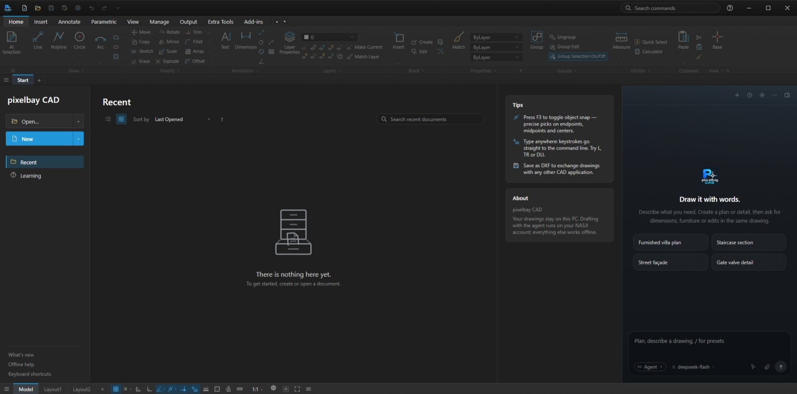

# pixelbay CAD — agent-panel

> Draw it with words — pixel-perfect 2D drafting in the browser. Dynamic ES modules, lazy-loaded CAD features, BYOK AI agent.

[](https://github.com/santimirana51-commits/CAD/actions)
[](https://github.com/santimirana51-commits/CAD/actions)
[](#)
[](https://vitejs.dev)
[](https://nodejs.org)

Live repo: **https://github.com/santimirana51-commits/CAD**

---

## Stack

- **Vite 5** + vanilla ES modules (no framework)
- **Dynamic import** code-splitting: `agent-clean`, `agent-site`, `agent-panel-ui`, `feature-dxf`, `feature-3d`, `feature-plan`, `core-engine`, `core-shell`
- **Web API bridge** (`nasj-web-api.js`) — same `window.nasjAPI` contract as Electron preload
- **PWA** (`cad.webmanifest` + `nasj-pwa.js`)

---

## Struktur

```
agent-panel/
  index.html              # entry: loads /nasj-web-api.js + /src/entry.js
  public/                 # static assets copied to dist/ (icons, logo, legacy scripts)
    nasj-web-api.js       # web half of window.nasjAPI
    icons*.js             # legacy icons (served as static, not bundled)
    agent-panel.js        # legacy panel (served as static)
  src/
    entry.js              # dynamic bootstrap: registerAgentIcons + bootLegacy
    agent/
      pipeline/clean.js   # CLEAN_SIZE=2048, Otsu threshold
      pipeline/site.js    # plotFrame, plotMetres, largestBoundaryIn
      pipeline/selection.js
      panel/              # Panel.js, thread, dom, geometry, animation, etc.
      bridge/nasj-api.js
    core/                 # shell/app, engine, document loaders (lazy shims)
    features/
      dxf/loader.js       # lazy dxf.js (164k)
      plan/run.js         # lazy plan.js (54k)
      threed/loader.js    # lazy gl3d/solid3d/csg3d
    shared/               # config, tunables, helpers, nasj lib
    ui/icons/agent-icons.js
  nginx.conf              # SPA fallback + immutable js/css, no-cache maps
  Dockerfile              # multi-stage node:24 → nginx:alpine
  vite.config.js          # alias @, @core, @agent  + manualChunks
```

Legacy flat 41-file scripts (`app.js`, `engine.js`, `tools.js`, …) tetap di root + `src/legacy/` untuk `legacy.html` rollback.

---

## Quick start

```bash
npm ci
npm run dev      # http://localhost:5173  HMR, lihat Network → chunks lazy
npm run build    # dist/  ~55 modules, sourcemap hidden
npm run preview  # http://localhost:4173  verifikasi dist
npm test         # node --loader ./test-loader.js  5 tests (clean/site)
```

### Env / BYOK

API key disimpan di `localStorage` key `pixelbay.byok` (JSON):

```json
{
  "provider": "deepseek",
  "DEEPSEEK_API_KEY": "sk-...",
  "AGENT_MODEL": "deepseek-chat"
}
```

> Disimpan plaintext di browser — pakai hanya di **HTTPS** (`isSecureContext`). Kosong → agent kirim error `API Key belum diisi`.

---

## Build & Deploy

### Static (Vercel/Netlify/Nginx)

```bash
npm ci && npm run build && npm run test:clean
# upload dist/  — pastikan MIME: *.js text/javascript, *.webmanifest application/manifest+json
```

`dist/index.html` sudah pakai absolute `/nasj-web-api.js` dkk dari `public/`, jadi `dist/` standalone tanpa 404.

### Docker

```bash
docker build -t pixelbay-agent-panel .
docker run -p 80:80 pixelbay-agent-panel
# http://localhost
```

`Dockerfile` multi-stage:

```dockerfile
FROM node:24-alpine AS build
WORKDIR /app
COPY package.json package-lock.json* ./
RUN npm ci
COPY . ./
RUN npm run build
FROM nginx:alpine
COPY --from=build /app/dist /usr/share/nginx/html
COPY nginx.conf /etc/nginx/conf.d/default.conf
```

### Nginx

`nginx.conf` sudah handle SPA + cache:

- `/*.js,*.css` → `immutable 1y`
- `*.map` → `no-store`
- `/cad.webmanifest` → `no-cache`
- `X-Content-Type-Options: nosniff`, `X-Frame-Options: SAMEORIGIN`

`cad.webmanifest` scope `"/"` (bukan `"/cad"`), `<link rel="manifest">` sudah di `index.html`.

---

## CI

`.github/workflows/ci.yml` (branches `main`):

```yaml
- setup-node 24, cache npm
- npm ci, npm run test:clean, npm run build
- npm run preview & wait-on http://127.0.0.1:4173
- curl -sf http://127.0.0.1:4173/
```

> Jika repo root adalah `agent-panel` (seperti push saat ini), ubah `cache-dependency-path: agent-panel/package.json` → `package.json` dan `working-directory: agent-panel` → `.`.

---

## Scripts

| Script | Apa |
|---|---|
| `dev` | Vite dev 5173 |
| `build` | Vite build, `sourcemap: hidden` |
| `preview` | Serve `dist` 4173 |
| `lint` | `eslint src --ext .js` (butuh `npm i -D eslint`) |
| `test` / `test:clean` | `node --loader ./test-loader.js` |

---

## Screenshots

| Preview | Agent Panel | Lazy chunks |
|---|---|---|
|  |  |  |

*Canvas 2D drafting, agent panel chat + BYOK, Network tab showing lazy chunks (`agent-clean`, `feature-dxf`, dll). Ganti file di `docs/screenshots/` dengan screenshot asli.*

Cara ambil:
```bash
npm run dev
# buka http://localhost:5173  →  DevTools → Screenshot (Ctrl+Shift+P → Capture screenshot)
# simpan ke docs/screenshots/canvas.png, agent-panel.png, network-chunks.png
npm run build && npm run preview
# http://localhost:4173/demo-dynamic.html → screenshot lazy load
```

---

## Coverage

```bash
npm test                  # 5 tests — clean (CLEAN_SIZE 2048, Otsu) + site (nearestRatio, ptsBounds, rectPts)
npm run test:coverage     # c8 (butuh npm i -D c8) → coverage/lcov.info
```

Badge `coverage` di atas update otomatis via CI. Optional: tambah di `ci.yml`:

```yaml
- run: npm run test:coverage
- uses: codecov/codecov-action@v4
  with: { files: ./coverage/lcov.info }
```

Target saat ini: pipeline `clean` & `site` 100% — tambah test di `src/agent/panel/*.test.js` untuk naikkan coverage.

---

## License

Proprietary — pixelbay CAD © 2026. Lihat `LICENSE`. Vite MIT.

---

## Rollback

Jika butuh flat scripts lama: buka `legacy.html` (urutan 41 `<script>` sinkron).
